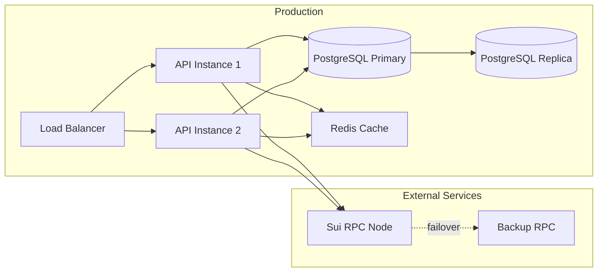

# Multisig API Architecture

## Overview
This service provides a backend API for managing Sui blockchain multisig wallets, proposals, and signatures.

## System Architecture

```
┌─────────────────────────────────────────────────────────┐
│                     Client Layer                         │
│  ┌──────────────┐        ┌──────────────┐              │
│  │ Web/Mobile   │        │   Sui SDK    │              │
│  │     App      │        │              │              │
│  └──────┬───────┘        └──────┬───────┘              │
└─────────┼───────────────────────┼──────────────────────┘
          │                       │
          ▼                       ▼
┌─────────────────────────────────────────────────────────┐
│                      API Layer                          │
│  ┌──────────────┐   ┌──────────────┐   ┌────────────┐ │
│  │Auth Service  │───│   REST API   │───│JWT Middle- │ │
│  │/auth/*       │   │              │   │   ware     │ │
│  └──────────────┘   └──────┬───────┘   └────────────┘ │
└─────────────────────────────┼──────────────────────────┘
                              │
          ┌───────────────────┼───────────────────┐
          ▼                   ▼                   ▼
┌─────────────────────────────────────────────────────────┐
│                   Business Logic                        │
│  ┌──────────────┐   ┌──────────────┐   ┌────────────┐ │
│  │  Multisig    │   │   Proposal   │   │  Address   │ │
│  │   Service    │   │   Service    │   │  Service   │ │
│  └──────┬───────┘   └──────┬───────┘   └─────┬──────┘ │
└─────────┼───────────────────┼─────────────────┼────────┘
          │                   │                  │
          └───────────────────┼─────────────────┘
                              ▼
┌─────────────────────────────────────────────────────────┐
│                    Data Layer                           │
│         ┌──────────────────────────────┐               │
│         │      Drizzle ORM              │               │
│         └──────────────┬───────────────┘               │
│                        ▼                                │
│         ┌──────────────────────────────┐               │
│         │      PostgreSQL              │               │
│         └──────────────────────────────┘               │
└─────────────────────────────────────────────────────────┘
                              │
                              ▼
┌─────────────────────────────────────────────────────────┐
│                     Blockchain                          │
│         ┌──────────────────────────────┐               │
│         │      Sui Network             │               │
│         └──────────────────────────────┘               │
└─────────────────────────────────────────────────────────┘
```

## API Flow Sequences

### 1. Authentication Flow
```
User                API               JWT              DB
 │                   │                 │                │
 │ POST /auth/connect│                 │                │
 ├──────────────────►│                 │                │
 │                   │                 │                │
 │ (signs message)   │                 │                │
 │                   ├─verify sig──►   │                │
 │                   │                 │                │
 │                   │ generate token  │                │
 │                   ├────────────────►│                │
 │                   │                 │                │
 │                   │           store address          │
 │                   ├───────────────────────────────►  │
 │                   │                 │                │
 │  JWT cookie       │                 │                │
 │◄──────────────────┤                 │                │
 │                   │                 │                │
 │ Request + cookie  │                 │                │
 ├──────────────────►│                 │                │
 │                   │  validate       │                │
 │                   ├────────────────►│                │
 │                   │  public keys    │                │
 │                   │◄────────────────┤                │
 │   Response        │                 │                │
 │◄──────────────────┤                 │                │
```

### 2. Multisig Creation Flow
```
Creator              API                DB             Members
 │                    │                 │                │
 │  POST /multisig    │                 │                │
 ├───────────────────►│                 │                │
 │                    │                 │                │
 │                    │ validate quorum │                │
 │                    ├─────────────►   │                │
 │                    │                 │                │
 │                    │ create multisig │                │
 │                    ├────────────────►│                │
 │                    │                 │                │
 │                    │ add members     │                │
 │                    │ (creator=true)  │                │
 │                    ├────────────────►│                │
 │                    │                 │                │
 │ multisig details   │                 │                │
 │◄───────────────────┤                 │                │
 │                    │                 │                │
 │                    │                 │   POST /accept │
 │                    │◄─────────────────────────────────┤
 │                    │                 │   (signed)     │
 │                    │                 │                │
 │                    │ update member   │                │
 │                    ├────────────────►│                │
 │                    │                 │                │
 │                    │ if all accepted │                │
 │                    │ mark verified   │                │
 │                    ├────────────────►│                │
```

### 3. Proposal Flow
```
Proposer            API               DB            Signers         Sui
 │                   │                 │                │            │
 │ POST /proposals   │                 │                │            │
 ├──────────────────►│                 │                │            │
 │ (TransactionBlock)│                 │                │            │
 │                   │                 │                │            │
 │                   │ store proposal  │                │            │
 │                   ├────────────────►│                │            │
 │                   │                 │                │            │
 │ proposal ID       │                 │                │            │
 │◄──────────────────┤                 │                │            │
 │                   │                 │                │            │
 │                   │                 │ POST /:id/sign │            │
 │                   │◄───────────────────────────────────┤           │
 │                   │                 │   (signature)  │            │
 │                   │                 │                │            │
 │                   │ store signature │                │            │
 │                   ├────────────────►│                │            │
 │                   │                 │                │            │
 │                   │ check threshold │                │            │
 │                   ├─────────────►   │                │            │
 │                   │                 │                │            │
 │                   │ if threshold met:                │            │
 │                   │ combine sigs    │                │            │
 │                   ├──────────────────────────────────────────────►│
 │                   │                 │                │   execute  │
 │                   │                 │                │◄───────────┤
 │                   │ update status   │                │            │
 │                   ├────────────────►│                │            │
```

## Data Model

### Core Entities

```
┌─────────────────────────────────────────────────────────────┐
│                         ADDRESSES                            │
├─────────────────────────────────────────────────────────────┤
│ publicKey (PK)  │ address         │ createdAt              │
└─────────────────────────────────────────────────────────────┘
                              │
                              │ 1:N
                              ▼
┌─────────────────────────────────────────────────────────────┐
│                    MULTISIG_MEMBERS                          │
├─────────────────────────────────────────────────────────────┤
│ multisigAddress (FK) │ publicKey (FK) │ weight │ isAccepted│
│ order                │                │        │            │
└─────────────────────────────────────────────────────────────┘
                              ▲
                              │ N:1
                              │
┌─────────────────────────────────────────────────────────────┐
│                         MULTISIGS                            │
├─────────────────────────────────────────────────────────────┤
│ address (PK)    │ name     │ threshold │ isVerified        │
│ createdAt       │          │           │                   │
└─────────────────────────────────────────────────────────────┘
                              │
                              │ 1:N
                              ▼
┌─────────────────────────────────────────────────────────────┐
│                         PROPOSALS                            │
├─────────────────────────────────────────────────────────────┤
│ id (PK)         │ multisigAddress (FK) │ proposer          │
│ tx              │ description         │ status             │
│ createdAt       │ expiresAt          │                    │
└─────────────────────────────────────────────────────────────┘
                              │
                              │ 1:N
                              ▼
┌─────────────────────────────────────────────────────────────┐
│                   PROPOSAL_SIGNATURES                        │
├─────────────────────────────────────────────────────────────┤
│ proposalId (FK) │ publicKey (FK) │ signature │ createdAt   │
└─────────────────────────────────────────────────────────────┘

Relationships:
- ADDRESSES ──1:N──> MULTISIG_MEMBERS (user can be in many multisigs)
- MULTISIGS ──1:N──> MULTISIG_MEMBERS (multisig has many members)
- MULTISIGS ──1:N──> PROPOSALS (multisig can have many proposals)
- PROPOSALS ──1:N──> PROPOSAL_SIGNATURES (proposal collects signatures)
- ADDRESSES ──1:N──> PROPOSAL_SIGNATURES (user signs proposals)
```

## Service Components

### Authentication Service (`/auth`)
- **Connect**: Sign-in with Sui wallet
- **Disconnect**: Clear specific public key from JWT
- **Verify**: Challenge-response signature verification

### Address Service (`/addresses`)
- **Register**: Store public key ↔ address mapping
- **Connections**: List multisigs (active/pending)
- **Lookup**: Get public key for an address

### Multisig Service (`/multisig`)
- **Create**: Initialize new multisig
- **Accept**: Join as a member
- **List**: Query multisigs by member

### Proposal Service (`/proposals`)
- **Create**: Submit transaction for signing
- **Sign**: Add signature to proposal
- **Execute**: Combine sigs and submit to chain
- **Query**: Filter by status, multisig, etc.

## Security Considerations

1. **JWT Authentication**
   - Short-lived tokens (30 min default)
   - Multiple public keys per JWT
   - HTTPOnly cookies

2. **Signature Verification**
   - Personal message signing for auth
   - Transaction signing for proposals
   - Multisig threshold enforcement

3. **Input Validation**
   - Address format validation
   - Quorum rules enforcement
   - Transaction data verification

## Deployment Architecture



## Testing Strategy

### Unit Tests
- Service logic validation
- Database operations
- Signature verification

### Integration Tests
- API endpoint testing
- Authentication flows
- Database transactions

### E2E Tests (with local Sui network)
- Complete multisig creation
- Proposal submission and signing
- On-chain transaction execution

## Usage Example

```typescript
// 1. Authenticate
const response = await fetch('/auth/connect', {
  method: 'POST',
  body: JSON.stringify({
    publicKey: keypair.getPublicKey().toBase64(),
    signature: await signMessage(keypair, message),
    expiry: new Date(Date.now() + 30 * 60 * 1000).toISOString()
  })
});

// 2. Create Multisig
const multisig = await fetch('/multisig', {
  method: 'POST',
  body: JSON.stringify({
    publicKey: creatorKey,
    addresses: [addr1, addr2, addr3],
    weights: [1, 1, 1],
    threshold: 2
  })
});

// 3. Submit Proposal
const proposal = await fetch('/proposals', {
  method: 'POST',
  body: JSON.stringify({
    multisigAddress: multisig.address,
    transactionBlock: txb.serialize(),
    description: 'Transfer 100 SUI to treasury'
  })
});

// 4. Collect Signatures
for (const signer of signers) {
  await fetch(`/proposals/${proposal.id}/sign`, {
    method: 'POST',
    body: JSON.stringify({
      publicKey: signer.publicKey,
      signature: await signTransaction(signer, txb)
    })
  });
}

// 5. Execute on-chain (automatic when threshold met)
```

## Performance Optimizations

- **Database Indexing**: On frequently queried fields
- **Connection Pooling**: Reuse database connections
- **Caching Strategy**: Redis for hot data
- **Batch Operations**: Bulk inserts/updates
- **Async Processing**: Background jobs for chain operations

## Monitoring & Observability

- **Health Checks**: `/health` endpoint
- **Metrics**: Response times, error rates
- **Logging**: Structured logs with correlation IDs
- **Alerts**: Threshold violations, chain connectivity

## Future Enhancements

1. **WebSocket Support**: Real-time proposal updates
2. **Notification System**: Email/push for pending signatures
3. **Analytics Dashboard**: Multisig usage statistics
4. **Backup & Recovery**: Automated database backups
5. **Multi-chain Support**: Extend beyond Sui